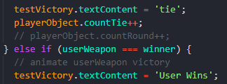

# RPS - The Classic Game of Rock, Paper, Scissors

[Project Management Board](https://github.com/JoBdaT/RPS/projects/1?add_cards_query=is%3Aopen)

The project was a team assignment. We selected something simple to work on - the ageold game of Rock, Paper, Scissors.
The game was built with HTML, JavaScript, CSS, used EaselJS and TweenJS for the animation functions and other resources mentioned at the end of this readme.

# Purpose: 

For entertainment and amusement.

**Authors:**  Clayton Jones, Daniel Nguyen, Thomas Tilahun, Bhagirath Bhatt

**Last Updated:** December 16, 2019

**Deployed Site:** https://jobdat.github.io/RPS/

## Technologies Used

JavaScript,
GitHub,
Ubuntu,
VS Code,
EaselJS,
TweenJS

## Features:

**Game Description**

Only one user can play against the cpu.
Enter your name into available name entry on the name entry page.
Once you enter your name, you select rounds (3, 5, 7) to play, select your weapon.
When you make your choice click "next" to start fight.
After Win, Loss, or Tie is determined, you can click "next" to play the next round.

**Name Entry**

The first page is a form to create a user data/profile. The checkUser function was used to verify if the user data existed, and if not created the profile and stored in local storage.image of code

**Function player data**

The player data code would populate the player name. The function checks for the user data. If user data exists then it is updated and stored in local storage. If notthen is creates the user profile and stores it in local storage. 

**Round Select Screen**

Featured three buttons with options to select 3, 5, or 7 rounds. Additionally we added a next and a back button. The next button advanced the game to the next round while the back button would take the player back to the name selection screen, essentially to start the game over. The rounds data was put into a constructor which moved it to a player constructor object.

**Round counter**

The rounds counter keeps track of the rounds played, win/losses by the users or cpu and stored the data to the local storage.

**Main Game Screen**

The screen featured the weapons choice buttons, Rock, Paper, Scissors. The user selects the weapon by clicking the button of their weapon choice, the CPU weapon is selected randomly and stored as a variable. Fight feature displays the battle animation. 

 Display the front page to begin the fight
 A reset stats button
 Created animation for playing rock paper scissors
 
**Animation screen**

The animation screen scrolls in the chosen weapons and animates the fight. the winner's weapon remains on the screen briefly while the loser weapon is "knocked off" the screen. In the eventof a tie both weapons remain on the screen briefly. A segment of the js code is displayed below.

**Code testing** 

To ensure funtionality testing functions were incorporated at speocic points in the js. This primarily allowed us to test the funtins nad features of the game as we moved along in makiing this game.

### RESOURCES:

How to determine if Javascript array contains an object with an attribute that equals a given value?
https://stackoverflow.com/questions/8217419/how-to-determine-if-javascript-array-contains-an-object-with-an-attribute-that-e

WindowOrWorkerGlobalScope.setTimeout()

https://developer.mozilla.org/en-US/docs/Web/API/WindowOrWorkerGlobalScope/setTimeout

Switch statement reference

https://developer.mozilla.org/en-US/docs/Web/JavaScript/Reference/Statements/switch

EaselJS and TweenJS docs used in creating animations

https://www.createjs.com/docs/easeljs/modules/EaselJS.html
https://www.createjs.com/docs/tweenjs/modules/TweenJS.html

How to check if JavaScript Object is empty (Example)

https://coderwall.com/p/_g3x9q/how-to-check-if-javascript-object-is-empty

Font High Score and About Me

https://fonts.google.com/

Background image

https://www.google.com/search?q=best+background+pictures+for+game&sxsrf=ACYBGNSzQ2O98-b9l_SnYGFcZHkxa6qGnw:1576552491157&source=lnms&tbm=isch&sa=X&ved=2ahUKEwiIz9HZ27vmAhXLPn0KHRYRC08Q_AUoAXoECA0QAw&biw=1203&bih=674#imgdii=Fu0SIuAtcs6XLM:&imgrc=7cb7tAJd3PzJ0M:
